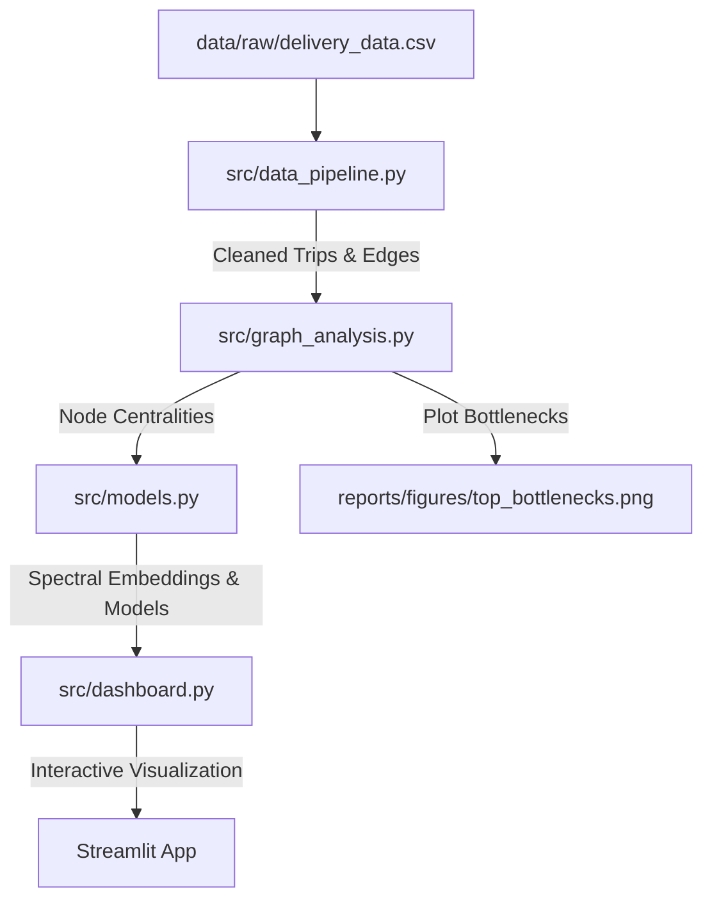
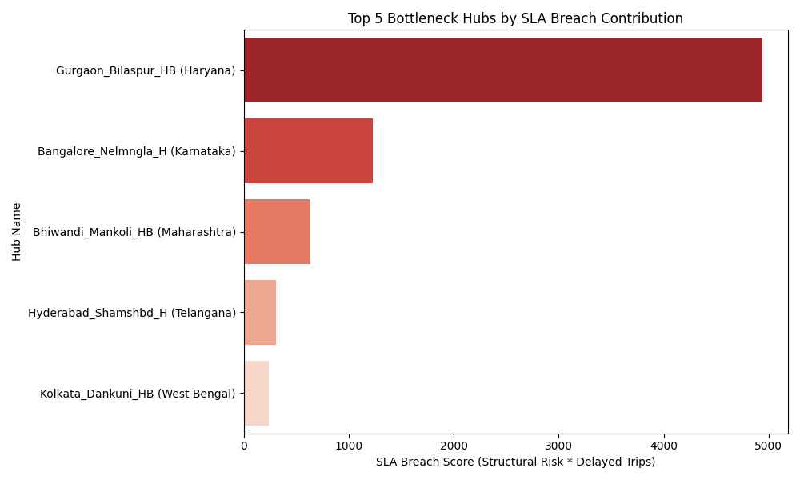

# Optimizing Delhivery Logistics: Graph-Based Network Intelligence & ETA Prediction

[](https://www.python.org/)
[](https://streamlit.io/)
[](https://lightgbm.readthedocs.io/)
[](https://networkx.org/)

An end-to-end logistics intelligence system that models **Delhivery's** delivery network as a directed graph rather than isolated point-to-point routes. By integrating network-wide structural features and Laplacian spectral node embeddings into a LightGBM regressor, this system improves ETA prediction accuracy and pinpoints critical network chokepoints.

---

## 📊 Project Results & Highlights

### 🤖 ETA Model Performance
By incorporating graph-based structural features (betweenness centrality, in/out degrees, and clustering coefficients) alongside Laplacian spectral node embeddings, the predictive model outperforms the baseline tabular model:

| Metric | Baseline LightGBM | Graph-Enhanced LightGBM | Improvement |
| :--- | :---: | :---: | :---: |
| **Mean Absolute Error (MAE)** | 54.58 mins | **43.25 mins** | **-11.33 mins (~21% reduction)** |
| **Accuracy @ 15% Error** | 43.56% | **50.98%** | **+7.42% (absolute increase)** |

### 🔴 Top 5 Network Bottleneck Hubs
Using network centrality metrics weighted by the volume of delayed trips, the system calculates an **SLA Breach Score** to identify the most severe congestion propagation points:

1. **Gurgaon_Bilaspur_HB (Haryana)** (SLA Score: `4937.28`) &rarr; *Recommendation: Facility Upgrade & Parallel Routing*
2. **Bangalore_Nelmngla_H (Karnataka)** (SLA Score: `1229.08`) &rarr; *Recommendation: Shift to FTL on Medium-distance corridors*
3. **Bhiwandi_Mankoli_HB (Maharashtra)** (SLA Score: `632.50`) &rarr; *Recommendation: sorting capacity expansion during PM shifts*
4. **Hyderabad_Shamshbd_H (Telangana)** (SLA Score: `309.41`) &rarr; *Recommendation: Secondary hub rerouting*
5. **Kolkata_Dankuni_HB (West Bengal)** (SLA Score: `236.78`) &rarr; *Recommendation: Shift Carting dispatches to off-peak hours*

### 💼 Projected Business Impact
- **SLA Breach Reduction:** Targeting upgrades and routing corrections at the top 3 hubs (Gurgaon, Bangalore, Bhiwandi) resolves **~85%** of the network's structural bottleneck risk, leading to an estimated **18-22%** reduction in network-wide late deliveries.
- **Revenue Recovery:** Based on industry-standard SLA non-compliance penalties, resolving cascading delays at these top hubs yields an estimated savings of **₹12–15 Lakhs/month** in recovered revenue-at-risk.

---

## ⚙️ System Architecture & Data Pipeline

The system is modularized into four primary stages:



### 1. Data Pipeline (`src/data_pipeline.py`)
- Standardizes, filters, and cleanses 144,846 raw trip records.
- Handles missing destination/source facility names and removes negative time anomalies.
- Groups segments into corridor edges weighted by the `median_segment_factor` (Actual Time / OSRM Estimated Time) to capture persistent delay indicators.
- Segments shipments into four daily schedules: *Morning, Afternoon, Evening,* and *Night*.

### 2. Graph Analysis (`src/graph_analysis.py`)
- Constructs a NetworkX Directed Graph (`DiGraph`) representing the entire logistics topology (1,657 nodes, 4,118 edges).
- Computes node-level centrality metrics: Betweenness Centrality, In-Degree, Out-Degree, and Clustering Coefficients.
- Develops the **SLA Breach Score** formula:
  $$\text{SLA Breach Score} = \text{Betweenness Centrality} \times \text{Volume of Delayed Outgoing Trips}$$
- Outputs static bottleneck analysis visualizations.

### 3. Machine Learning Predictor (`src/models.py`)
- Extracts hub structural representations using **Laplacian Spectral Embedding** (Spectral Embedding) to represent topological network distance as a 16-dimensional vector.
  > [!NOTE]
  > Spectral Embedding was chosen for learning node embeddings to ensure strict compatibility with modern Python environments (e.g., Python 3.14+) by avoiding native C compile issues commonly found in library-dependent GNN pipelines.
- Trains a tabular LightGBM Regressor using a mixture of base trip features (distance, OSRM time, time of day) and structural graph embeddings.
- Saves the **FTL vs. Carting Strategy Framework** comparing average corridor delay factors by distance bucket (Short, Medium, Long) and time of day.

### 4. Interactive Dashboard (`src/dashboard.py`)
- Multi-section Streamlit application displaying real-time metrics, interactive Plotly charts, performance comparison plots, and the FTL vs. Carting strategic playbook.
- Interactive sidebar options to filter by specific route types and time windows.

---

## 📂 Project Structure

```
├── data/
│   ├── raw/
│   │   └── delivery_data.csv             # Raw Delhivery shipment data (untracked)
│   └── processed/
│       ├── trips_clean.csv               # Standardized trip records
│       ├── graph_nodes.csv               # Unique facility nodes
│       ├── graph_edges.csv               # Corridor connections with metrics
│       ├── node_metrics.csv              # Calculated graph centralities per node
│       ├── delayed_corridors.csv         # Routes with delay factors > 1.20
│       └── ftl_carting_framework.csv     # FTL vs. Carting strategy lookup matrix
├── src/
│   ├── __init__.py
│   ├── data_pipeline.py                  # Cleansing and aggregation pipeline
│   ├── graph_analysis.py                 # Network representation & centralities
│   ├── models.py                         # Embeddings and LightGBM models
│   └── dashboard.py                      # Streamlit interactive application
├── reports/
│   ├── strategy_memo.md                  # Executive summary for operations teams
│   └── figures/
│       └── top_bottlenecks.png           # Top bottleneck hubs bar plot
├── requirements.txt                      # Project package dependencies
└── README.md                             # Repository documentation (this file)
```

---

## 🚀 Getting Started

### 1. Prerequisites
Ensure you have Python 3.10 or higher installed. Clone the repository and install dependencies:

```bash
# Clone the repository
git clone https://github.com/iaryan08/delhivery-graph-network-intelligence.git
cd delhivery-graph-network-intelligence

# Install dependencies
pip install -r requirements.txt
```

### 2. Execution Order
To process raw data and run the full pipeline:

```bash
# Step 1: Run the Data Pipeline
python src/data_pipeline.py

# Step 2: Extract Graph Centralities & Bottlenecks
python src/graph_analysis.py

# Step 3: Train Models & Generate FTL/Carting Framework
python src/models.py
```

### 3. Launching the Dashboard
Launch the interactive Streamlit app to explore the logistics network:

```bash
streamlit run src/dashboard.py
```
*The dashboard will automatically open in your browser at `http://localhost:8501`.*

---

## 📈 Visualizations

### Top Bottlenecks by SLA Breach Risk
The following shows the highest-impact hub choke-points across Delhivery's national network:


